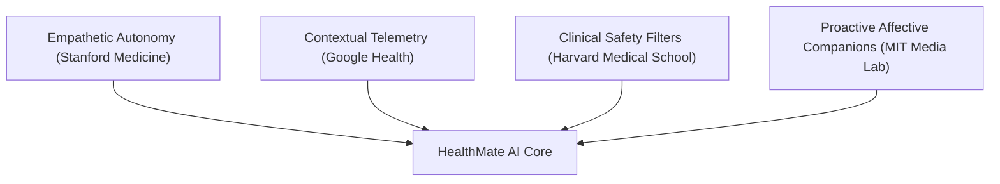

# Master Vision & Roadmap: The "Big Wise" & "Big Plan" for HealthMate AI

This document establishes the strategic foundation, behavioral philosophy ("Big Wise"), and long-term development roadmap ("Big Plan") for **HealthMate AI**. These guidelines align our codebase with the latest clinical studies, behavioral change frameworks, and artificial intelligence research from top-tier universities and technology companies.

---

## 👁️ The "Big Wise" (Filosofi & Visi Utama)

Traditional health applications act as **passive digital ledger books**—they record water intake, track steps, or count calories, but place the cognitive burden of interpretation entirely on the user.

**HealthMate AI's Vision:** To shift the paradigm from *passive tracking* to *empathetic, context-aware digital companion coaching*. 

Our architecture is guided by four pillars of wisdom:



### 1. Empathetic Autonomy (Stanford Prevention Research Center)
We implement **Motivational Interviewing (MI)** and the **Transtheoretical Model (TTM)** of behavior change. The AI must never command or judge. Instead, it guides users by asking open-ended questions, encouraging self-efficacy, and building long-term habits.

### 2. Contextual Telemetry (Google Health)
Health coaching is useless without personal context. By reading local browser telemetry (sleep logs, activity steps, calorie counts), the AI interprets raw tracking data into actionable insights, providing an expert-level advisory experience similar to specialized personal coaches.

### 3. Absolute Clinical Safety (Harvard Medical School)
An AI companion is not a doctor. We maintain strict safety boundaries by immediately identifying emergency clinical keywords (e.g., chest pain, shortness of breath) at the browser level and redirecting users to emergency resources before an LLM hallucination can occur.

### 4. Proactive Digital Companionship (MIT Media Lab)
Healthy habits are formed through nudges. Rather than staying as a static chat bubble, the companion mascot (Medi) dynamically changes expressions and reacts to the user's daily achievements and shortcomings, simulating a living companion.

---

## 🗺️ The "Big Plan" (Peta Jalan Teknis)

| Phase | Milestone | Focus Area | Status | Key Files |
| :--- | :--- | :--- | :--- | :--- |
| **Phase 1** | Bilingual UI & Stanford MI Tone | Multi-language support and empathetic prompts. | **Completed** | [translations.ts](file:///d:/HealthMate%20AI/src/utils/translations.ts), [geminiAi.ts](file:///d:/HealthMate%20AI/src/services/geminiAi.ts) |
| **Phase 2** | Google PH-LLM Context Integration | Binding local storage tracking logs into LLM prompts. | **Completed** | [Chat.tsx](file:///d:/HealthMate%20AI/src/pages/Chat.tsx) |
| **Phase 3** | MIT Mascot Nudging | Dynamic mascot states based on logged metrics. | **Completed** | [HealthCompanion.tsx](file:///d:/HealthMate%20AI/src/components/HealthCompanion.tsx) |
| **Phase 4** | Advanced Multi-Modal Coaching | Voice chat and OCR prescription/food photo parsing. | *Planned* | `src/services/voiceService.ts` |
| **Phase 5** | Cloud Synchronization & Privacy | Secure cloud-native sync with Firebase/Supabase. | *Planned* | `src/context/AuthContext.tsx` |
| **Phase 6** | Clinical-Grade Dashboard UX | KPI scorecards, semantic color system, mini trend charts, alarm fatigue prevention. | *Planned* | `src/pages/Dashboard.tsx` |
| **Phase 7** | Hospital Management Module | Separate enterprise B2B system: HL7 FHIR, RBAC, multi-patient EMR, SATUSEHAT compliance. | *Concept* | `hospital-dashboard/` (new repo) |

### 🚀 Future Milestone Details

#### Phase 4: Advanced Multi-Modal Coaching (Voice & Image)
* **Voice Chat:** Integrate the browser's Web Speech API for voice-to-text input and text-to-speech output to allow the user to speak directly to the mascot.
* **Image OCR & Vision:** Allow users to upload photos of food or physical prescriptions. Use Gemini's multimodal capabilities (`gemini-2.5-flash` or `gemini-2.5-pro`) to calculate nutritional data and explain prescription dosages.

#### Phase 5: Secure Cloud Sync
* **Secure Hybrid Database:** Move beyond LocalStorage to a cloud database (Firebase/Supabase) with end-to-end client-side encryption, matching strict health information privacy rules.
* **Multi-Device Synchronization:** Allow users to track metrics on their phones and view them on their desktops, retaining their custom chat history securely.

#### Phase 6: Clinical-Grade Dashboard UX
Inspired by global healthcare UI/UX standards (HIMSS, ISO 9241, WCAG AA). Adopts hospital-grade design principles for the personal Dashboard:
* **KPI Scorecards:** Replace raw input forms with Big Number scorecards for BMI, water, calories, and sleep — achieving 1-second readability.
* **Semantic Color System:** Strict color rules — Red for critical only, Green for healthy/normal, Blue for neutral data. No decorative colors in health metrics.
* **Mini Trend Charts:** Inline SVG/Canvas sparklines for 7-day water, calorie, and heart rate trends using existing log data.
* **Alarm Fatigue Prevention:** Categorize all mascot (Medi) alerts into 3 levels: `CRITICAL` (red, audible), `WARNING` (yellow), `INFO` (silent mascot only).
* **3-Click Rule:** Deep-link from Home KPIs directly to the relevant Dashboard section.
* **Reference:** HIMSS Analytics, ISO 9241-210, WCAG 2.1 AA.

#### Phase 7: Hospital Management Module (Enterprise B2B — New Repository)
A separate, standalone enterprise product for hospital staff and management. **Not part of HealthMate AI core.** Requires a dedicated backend and team.

**Architecture:**
```
Frontend (Next.js)  →  HL7 FHIR R4 Backend (Node.js/Java)  →  PostgreSQL + TimescaleDB
     ↑                         ↑
  RBAC/SSO               Real-time WebSocket
  (Keycloak)             (ICU vitals, alerts)
```

**Key Modules:**
* **Bed Management Board:** Real-time occupancy heatmap, transfer queue, projected discharge.
* **Critical Patient Monitor:** Live vitals (HR, SpO2, BP) from ICU devices via HL7 FHIR `Observation` resources.
* **Blood Bank Dashboard:** Stock levels per blood type with semantic red alerts when below critical threshold.
* **ER Triage Flow:** Hourly/daily ER visit bar charts + wait time line charts.
* **EMR Drill-down:** Click any metric → 3-click max to patient Electronic Medical Record.
* **Role Views:** Separate UI for Doctor, Nurse, Admin, and Executive (C-suite summary view).

**Compliance Requirements:**
* 🔒 **SATUSEHAT (Indonesia):** API integration for national health data exchange.
* 🔒 **HL7 FHIR R4:** Standard for real-time multi-source data ingestion.
* 🔒 **HIPAA/PDPA:** Data masking on public screens (nurse stations), full audit log.
* ♿ **WCAG AA:** Minimum 4.5:1 contrast ratio, color-blind friendly (always pair color with icon + text).
* 📋 **ISO 13485:** Medical device software quality management system.

**Estimated Timeline:** 3–6 months with a dedicated team of 3–4 engineers.

---


## 📚 Academic & Corporate References

These publications serve as the scientific benchmark for HealthMate AI's features:

### 1. Stanford University (Prevention Research Center)
* **Paper:** *"Bloom: Designing for LLM-Augmented Behavior Change Interactions"* (ACM CHI 2026)
* **Key Finding:** Conversational agents using Motivational Interviewing do not just track metrics; they dramatically improve user self-compassion, self-efficacy, and enjoyment during fitness programs.
* **Repo Reference:** [StanfordHCI/Bloom](https://github.com/StanfordHCI/Bloom)

### 2. Google Health
* **Paper:** *"A personal health large language model for sleep and fitness coaching"* (Nature Medicine, August 2025)
* **Key Finding:** Fine-tuned LLMs (PH-LLM) can interpret longitudinal wearable time-series metrics, scoring 79% in sleep medicine and 88% in fitness examinations, matching or exceeding human coaching experts.
* **DOI Reference:** [10.1038/s41591-025-03888-0](https://doi.org/10.1038/s41591-025-03888-0)

### 3. MIT Media Lab (Fluid Interfaces Group)
* **Research Focus:** *Empathetic Conversational Agents for Well-being*
* **Key Finding:** AI companions that utilize "just-in-time" behavioral nudges based on tracking context are significantly more effective at preventing user disengagement in digital health programs.

### 4. Harvard Medical School / Stanford Biodesign
* **Paper:** *"CRAFT-MD: Clinical Conversational AI Safety Evaluation"* (2024/2025)
* **Key Finding:** Chatbots require strict client-side triaging and fallback alerts for acute symptoms to avoid dangerous user self-diagnosis.
