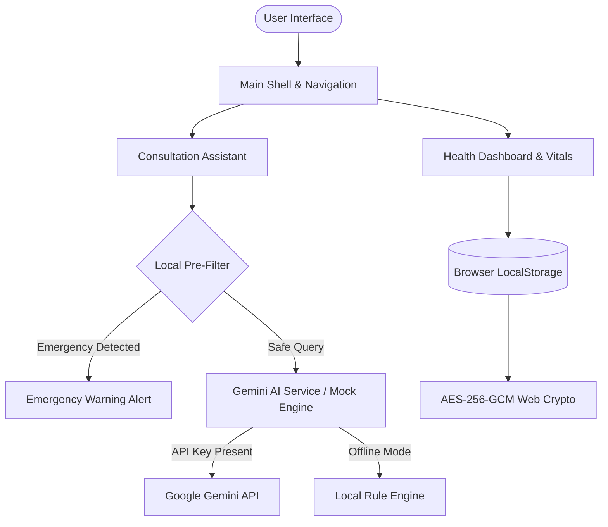

# HealthMate AI 🩺

> **Modern, Empathetic, and Secure Healthcare AI Assistant Web Application**

[](https://www.typescriptlang.org/)
[](https://react.dev/)
[](https://vitejs.dev/)
[](https://tailwindcss.com/)
[](https://developer.mozilla.org/en-US/docs/Web/API/Web_Crypto_API)
[](LICENSE)

**HealthMate AI** is a state-of-the-art client-side health education assistant built with React 19, TypeScript, and Tailwind CSS. It empowers users with AI-driven health consultations, interactive vital tracking, and personalized wellness dashboards while maintaining strict data privacy through client-side Web Crypto AES-256-GCM encryption.

---

> ⚠️ **IMPORTANT MEDICAL DISCLAIMER:**  
> HealthMate AI is designed strictly for **educational and self-care tracking purposes**. It does **NOT** provide medical diagnoses, clinical treatments, or replace professional evaluation by a licensed healthcare practitioner. If you experience emergency symptoms (e.g. severe chest pain or breathing difficulty), immediately dial emergency services (112 / 911).

---

## 🌟 Key Features

### 🩺 AI Consultation Assistant
- **Context-Aware Health Guidance:** Empathetic, Motivational Interviewing (MI) aligned consultation responses.
- **Pre-LLM Clinical Safety Guardrails:** Local regex pre-filtering for emergency symptoms (chest pain, stroke, poisoning) and improper content.
- **Multi-Model Support:** Native integration with Google Gemini 2.5 Flash, 2.5 Pro, and 2.0 Flash models.
- **Offline Fallback Engine:** Graceful degraded mode using local regex & rule-based engines when no API key is provided.
- **PDF Report Generation:** One-click export of clinical consultation summaries with vitals for physician review.

### 📊 Comprehensive Health Dashboard
- **BMI Calculator:** Calculated using WHO Asia-Pacific 2004 clinical standards (Underweight < 18.5, Normal < 23.0, Overweight < 27.5, Obese ≥ 27.5).
- **Daily Hydration Tracker:** Instant log buttons (+250ml / +500ml) with custom daily goal targets.
- **Calorie & Nutrition Journal:** Categorized meal logging (Breakfast, Lunch, Dinner, Snack).
- **Physical Activity Log:** Duration, step counter, and activity classification.
- **Sleep Quality Journal:** Sleep duration & self-reported sleep quality tracking.
- **Heart Vitals Monitor:** Resting heart rate (BPM) & blood pressure (mmHg) history.
- **Medication Reminder:** Interactive daily checklist for medications and supplements.
- **Streak & Habit Gamification:** Milestone tracking (7-day, 30-day, 100-day consistency).

### 🔒 Enterprise Privacy & Security
- **Client-Side Encryption:** Local health data backup encrypted using **AES-256-GCM (256-bit)** with PBKDF2 100,000-iteration key derivation via Web Crypto API.
- **Zero Third-Party Tracking:** 100% of health data remains stored locally in browser `localStorage`.
- **Zero API Key Leakage:** API keys are stored strictly in local state and never sent to intermediary proxy servers.

---

## 🛠️ Architecture & Tech Stack



| Layer | Technology |
|---|---|
| **Frontend Framework** | React 19 + TypeScript (Strict Mode) |
| **Build & Tooling** | Vite 8 + ESBuild |
| **Styling & Aesthetics** | Tailwind CSS v4 + Glassmorphism Tokens |
| **Animation Engine** | Framer Motion |
| **Icons & Media** | Lucide React + Phosphor Icons |
| **Security Layer** | Web Crypto API (SubtleCrypto AES-GCM + PBKDF2) |

---

## 🚀 Getting Started

### Prerequisites
- **Node.js**: v18.0.0 or higher
- **Package Manager**: `npm` (v9+) or `pnpm` / `yarn`

### Quick Start

```bash
# 1. Clone repository
git clone https://github.com/loxleyftsck/HealthMate-AI.git
cd HealthMate-AI

# 2. Install dependencies
npm install

# 3. Create environment configuration (Optional)
cp .env.example .env

# 4. Launch development server
npm run dev
```

App will be available at `http://localhost:5173`.

---

## 🔑 AI Configuration

HealthMate AI supports both **Offline Mode** and **Live AI Consultation**:

1. Obtain a free Gemini API key from [Google AI Studio](https://aistudio.google.com/).
2. Open app → **Settings** → **Gemini API Configuration**.
3. Input your API key, select your preferred model, and click **Save Configuration**.

> Without an API key, HealthMate AI operates seamlessly in **Offline Mode** using pre-configured health education modules.

---

## 📄 License

Distributed under the **MIT License**. See `LICENSE` for more information.

---

<p align="center">
  Crafted with care for open-source health technology & education.
</p>
